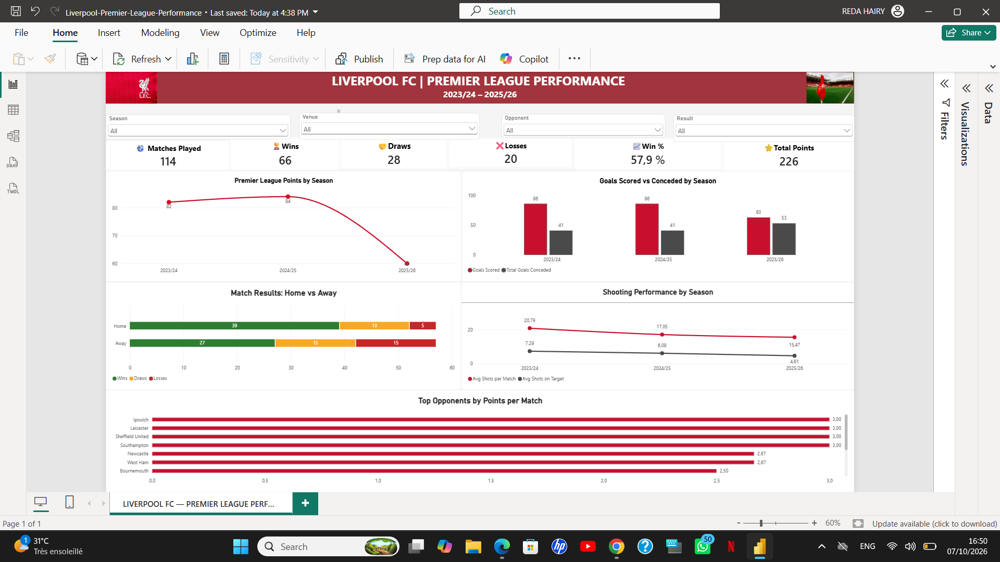

# Liverpool FC Premier League Performance Analysis ⚽

## 📊 Project Overview
This Power BI project analyzes Liverpool FC's Premier League performance across three seasons: 2023/24, 2024/25, and 2025/26.

The goal is to explore how the team's performance evolved across the three seasons using match results, goals, shooting statistics, home/away performance, and opponent analysis.

## 🖼️ Dashboard

## 🔍 Key Metrics
- Matches Played: 114
- Wins: 66
- Draws: 28
- Losses: 20
- Win Rate: 57.9%
- Total Points: 226

## 📈 Dashboard Analysis
The dashboard includes:
- Premier League points by season
- Goals scored vs. goals conceded
- Home vs. away match results
- Shooting performance by season
- Top opponents by points per match
- Interactive filters for Season, Venue, Opponent, and Result

## 🛠️ Tools & Skills
- Power BI
- Power Query
- DAX
- Data Cleaning
- Data Transformation
- Data Visualization
- Dashboard Design

## 📂 Data Source
Match data was obtained from Football-Data.co.uk and prepared in Power Query before analysis.

The original CSV datasets used for the project are available in the `data` folder.

## 🎯 Project Objective
This project was created as part of my Data Analyst portfolio to demonstrate my ability to transform raw data, create DAX measures, identify performance trends, and build an interactive Power BI dashboard.
